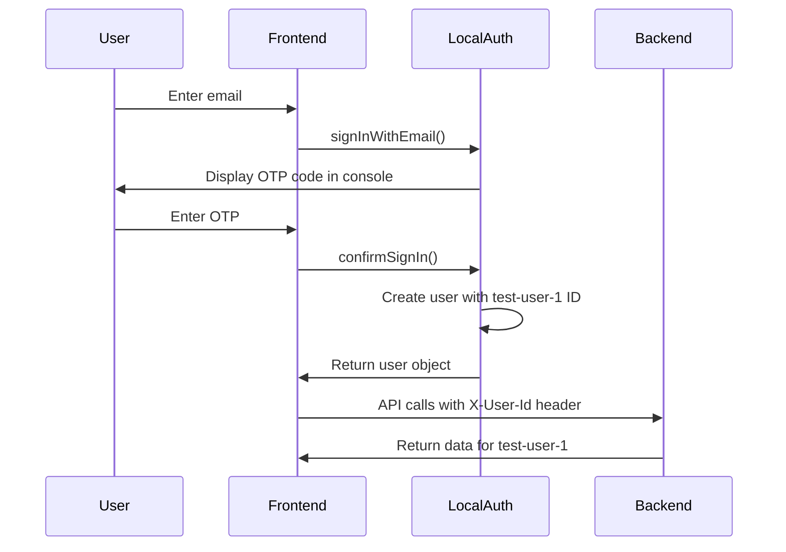

# Local Backend Connection Setup

This document explains how to connect the frontend app to the local backend server for development.

## Overview

The frontend now supports three modes:

| Mode | Auth | API | Use Case |
|------|------|-----|----------|
| **Mock API** | In-memory mock | In-memory mock data | Frontend-only development |
| **Local Backend** | Mock auth with test user | Real local backend API | Full-stack local development |
| **Production** | AWS Cognito | Production API | Deployed environment |

## Quick Start

### 1. Start the Backend Server

```bash
cd backend
npm run dev
```

The backend will start on `http://localhost:3000` (or `http://0.0.0.0:3000` for network access).

### 2. Configure Frontend for Local Backend

The `.env.local` file has been created with the following configuration:

```env
EXPO_PUBLIC_USE_MOCK_API=false
EXPO_PUBLIC_USE_LOCAL_BACKEND=true
EXPO_PUBLIC_API_URL=http://localhost:3000
EXPO_PUBLIC_LOCAL_USER_ID=test-user-1
```

### 3. Start the Frontend

```bash
cd frontend
npx expo start
```

The frontend will automatically load `.env.local` and connect to your local backend.

## How It Works

### Authentication Flow



### API Request Flow

When `USE_LOCAL_BACKEND=true`:

1. **Authentication**: Uses `localAuthService` which creates a user with ID `test-user-1`
2. **Session Token**: Returns the user ID (`test-user-1`) as the session token
3. **API Calls**: Adds `X-User-Id: test-user-1` header instead of `Authorization: Bearer ...`
4. **API URL**: Uses `http://localhost:3000` without `/api` prefix (backend routes are at root)

### Code Changes Summary

#### 1. Environment Configuration (`.env.local`)

New environment variables:
- `EXPO_PUBLIC_USE_LOCAL_BACKEND=true` - Enables local backend mode
- `EXPO_PUBLIC_LOCAL_USER_ID=test-user-1` - Test user ID to use

#### 2. Auth Service (`services/auth.ts`)

Added `localAuthService`:
- Simulates OTP login flow (same UX as mock auth)
- Creates user with predefined test user ID from environment
- Returns user ID as session token (used for X-User-Id header)
- Logs actions with `[LOCAL BACKEND]` prefix for debugging

Service selection logic:
```typescript
const authService = USE_LOCAL_BACKEND 
  ? localAuthService 
  : (USE_MOCK_API ? mockAuthService : amplifyAuthService);
```

#### 3. API Service (`services/api.ts`)

Updated `fetchWithAuth`:
- Detects local backend mode via `USE_LOCAL_BACKEND` flag
- Adds `X-User-Id` header instead of `Authorization` header
- Removes `/api` prefix from API URL for local backend
- Logs requests with `[LOCAL BACKEND]` prefix

API URL logic:
```typescript
const API_URL = USE_LOCAL_BACKEND
  ? (process.env.EXPO_PUBLIC_API_URL || 'http://localhost:3000')
  : (process.env.EXPO_PUBLIC_API_URL || 'http://localhost:3000/api');
```

## Testing the Connection

### 1. Login Flow

1. Start both backend and frontend
2. Open the app and go to login screen
3. Enter any valid email (e.g., `test@example.com`)
4. Check the console for the OTP code: `[LOCAL BACKEND] Mock OTP Code: 123456`
5. Enter the OTP code
6. You should be logged in as `test-user-1`

### 2. Verify API Calls

Check the frontend console for logs like:
```
[LOCAL BACKEND] Request to: /batches with X-User-Id: test-user-1
```

Check the backend console for logs like:
```
[OFFLINE] Using test user: test-user-1 (test-user-1@example.com)
```

### 3. Test Data Access

The backend is pre-seeded with test data:
- **test-user-1** owns:
  - `batch-1`: Strawberry Kefir (stage1_open, active)
  - `batch-2`: Plain Kefir (stage2_bottled, in_fridge)
- **test-user-2** owns:
  - `batch-3`: Blueberry Kefir (stage1_open, active)

You should see batches 1 and 2 when logged in as `test-user-1`.

## Switching Between Modes

### Use Mock API (Frontend Only)

Create `.env.local`:
```env
EXPO_PUBLIC_USE_MOCK_API=true
EXPO_PUBLIC_USE_LOCAL_BACKEND=false
```

### Use Local Backend (Full Stack)

Create `.env.local`:
```env
EXPO_PUBLIC_USE_MOCK_API=false
EXPO_PUBLIC_USE_LOCAL_BACKEND=true
EXPO_PUBLIC_API_URL=http://localhost:3000
EXPO_PUBLIC_LOCAL_USER_ID=test-user-1
```

### Use Production (AWS)

Create `.env.production`:
```env
EXPO_PUBLIC_USE_MOCK_API=false
EXPO_PUBLIC_USE_LOCAL_BACKEND=false
EXPO_PUBLIC_API_URL=https://your-api-gateway-url.com/api
EXPO_PUBLIC_AWS_USER_POOL_ID=us-east-1_XXXXXXX
EXPO_PUBLIC_AWS_USER_POOL_WEB_CLIENT_ID=XXXXXXXXX
```

## Switching Test Users

To test with different users, update `.env.local`:

```env
EXPO_PUBLIC_LOCAL_USER_ID=test-user-2
```

Then restart the frontend app. You'll now see `test-user-2`'s data (batch-3).

## Troubleshooting

### "Cannot connect to backend"

**Check:**
1. Backend is running: `cd backend && npm run dev`
2. Backend is on port 3000: Look for "http://localhost:3000" in startup logs
3. `.env.local` has correct API_URL

### "No batches showing up"

**Check:**
1. Console logs show `[LOCAL BACKEND]` messages
2. Backend console shows `[OFFLINE]` messages
3. User ID matches a test user: `test-user-1` or `test-user-2`

### "Still getting Cognito error"

**Check:**
1. `.env.local` exists in `frontend/` directory
2. `EXPO_PUBLIC_USE_LOCAL_BACKEND=true` is set
3. Restart the Expo dev server (Ctrl+C and `npx expo start`)

### "API calls have wrong path"

The local backend serves routes at root level:
- ✅ Correct: `http://localhost:3000/batches`
- ❌ Wrong: `http://localhost:3000/api/batches`

The code automatically handles this when `USE_LOCAL_BACKEND=true`.

## Mobile Device Testing

To test on a physical device on the same network:

1. Find your computer's local IP (shown in backend startup logs)
2. Update `.env.local`:
   ```env
   EXPO_PUBLIC_API_URL=http://192.168.1.100:3000
   ```
3. Restart frontend
4. Ensure backend is bound to `0.0.0.0` (it should be by default)

## Next Steps

- Test all app features with local backend
- Create additional test users/batches as needed
- Deploy to AWS when ready (see `backend/DEPLOYMENT.md`)

## Environment Variables Reference

| Variable | Mock API | Local Backend | Production |
|----------|----------|---------------|------------|
| `EXPO_PUBLIC_USE_MOCK_API` | `true` | `false` | `false` |
| `EXPO_PUBLIC_USE_LOCAL_BACKEND` | `false` | `true` | `false` |
| `EXPO_PUBLIC_API_URL` | N/A | `http://localhost:3000` | `https://api.example.com/api` |
| `EXPO_PUBLIC_LOCAL_USER_ID` | N/A | `test-user-1` | N/A |
| `EXPO_PUBLIC_AWS_USER_POOL_ID` | N/A | N/A | `us-east-1_XXX` |
| `EXPO_PUBLIC_AWS_USER_POOL_WEB_CLIENT_ID` | N/A | N/A | `XXXXXXXXX` |

